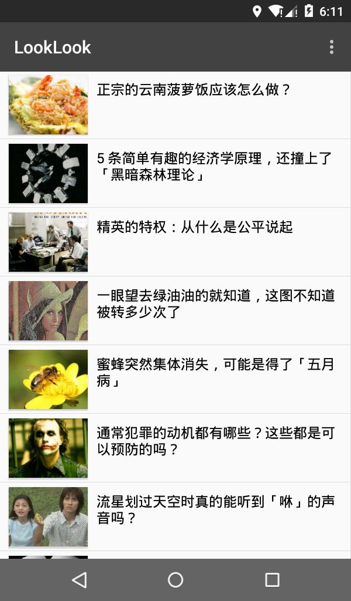
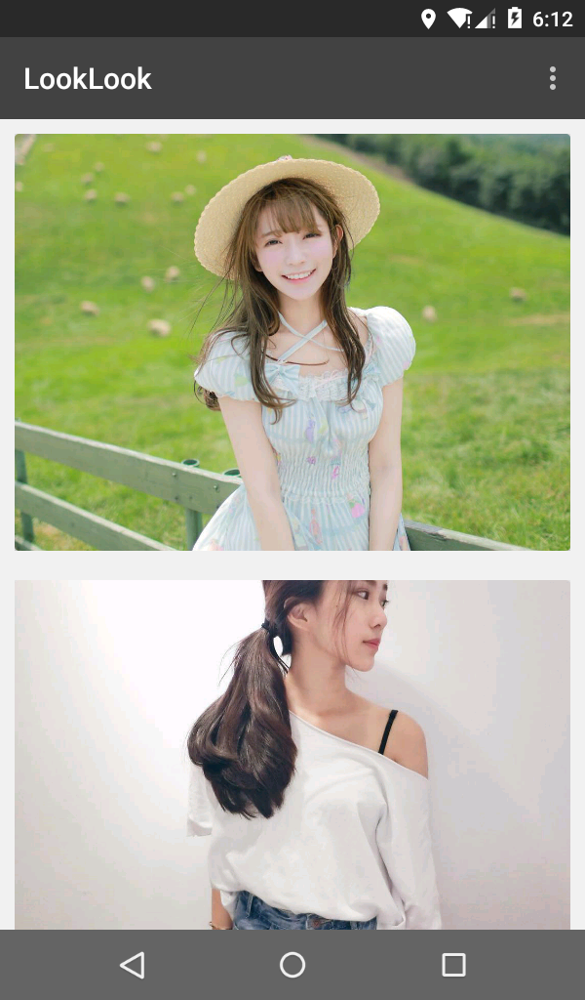
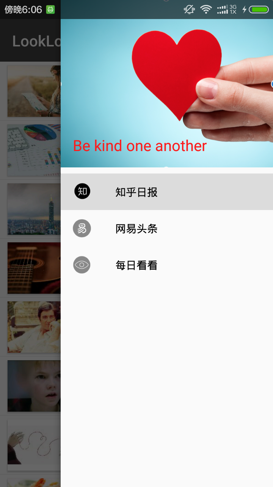
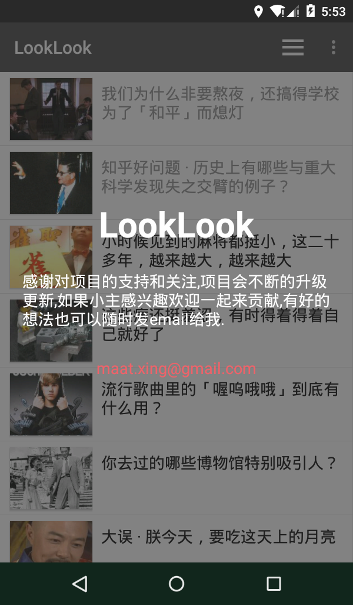

# LookLook 

This is a reading news app. you can read Zhihu Daily， News and some pictures.User experience is amasing.The project is updating, welcome to Star and Fork.

## Screenshots

##About me

An android developer in Beijing.Welcome to offer me an [Interview invitation](mailto:maat.xing@gmail.com). If you have any new idea about this project, feel free to [contact me](mailto:maat.xing@gmail.com). :smiley:

License
=======

    Copyright 2016 Maat

    Licensed under the Apache License, Version 2.0 (the "License");
    you may not use this file except in compliance with the License.
    You may obtain a copy of the License at

       http://www.apache.org/licenses/LICENSE-2.0

    Unless required by applicable law or agreed to in writing, software
    distributed under the License is distributed on an "AS IS" BASIS,
    WITHOUT WARRANTIES OR CONDITIONS OF ANY KIND, either express or implied.
    See the License for the specific language governing permissions and
    limitations under the License.

