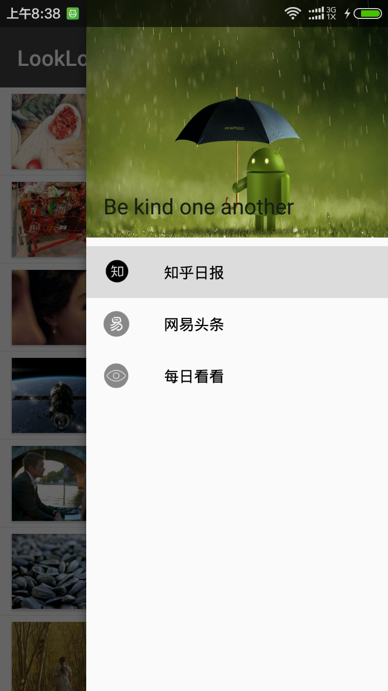

# LookLook 

目前包括三个模块：知乎日报、网易头条、每日看看，其中每日看看数据来自干活集中营。项目旨在打造一款极简的阅读app，优化用户体验。未来会加入更多有意思的模块。（项目还存在很多问题，持续更新中，欢迎star）


### Screenshots





**About me**

An android developer in Beijing.

Welcome to offer me an internship. 


```
Copyright 2015 Google, Inc.

Licensed to the Apache Software Foundation (ASF) under one or more contributor
license agreements. See the NOTICE file distributed with this work for
additional information regarding copyright ownership. The ASF licenses this
file to you under the Apache License, Version 2.0 (the "License"); you may not
use this file except in compliance with the License. You may obtain a copy of
the License at

http://www.apache.org/licenses/LICENSE-2.0

Unless required by applicable law or agreed to in writing, software
distributed under the License is distributed on an "AS IS" BASIS, WITHOUT
WARRANTIES OR CONDITIONS OF ANY KIND, either express or implied. See the
License for the specific language governing permissions and limitations under
the License.
```
